# CI/CD Implementation Summary

This document provides a high-level overview of the CI/CD pipeline implementation for the Louden Swain wrestling platform.

## What Was Implemented

### 🔧 GitHub Actions Workflows

1. **Continuous Integration** (`.github/workflows/ci.yml`)
   - Runs on every push and PR
   - Frontend: linting, type checking, build verification
   - Backend: linting (flake8), formatting (black), import sorting (isort), tests (pytest)
   - Security scanning (npm audit, Python safety)

2. **Production Deployment** (`.github/workflows/deploy-production.yml`)
   - Triggers on push to `main` branch
   - Quality gates → Deploy to Vercel production
   - Manual trigger support

3. **Test Environment Deployment** (`.github/workflows/deploy-test.yml`)
   - Triggers on push to `test` branch
   - Quality gates → Deploy to Vercel test environment
   - Comments deployment URL on commits

4. **Preview Deployments** (`.github/workflows/deploy-preview.yml`)
   - Triggers on pull requests
   - Creates preview deployments for code review
   - Comments preview URL on PRs

### ⚙️ Configuration Files

- **`vercel.json`**: Full-stack deployment configuration (Next.js + FastAPI)
- **Updated `package.json`**: Added comprehensive test and quality check scripts
- **`setup.sh`**: Automated development environment setup script

### 📚 Documentation

- **`DEPLOYMENT.md`**: Comprehensive deployment guide
- **Updated `README.md`**: Added CI/CD workflow information
- **Issue Template**: Deployment-specific GitHub issue template

### 🛠️ Quality Improvements

- **Fixed Build Issues**: Created missing frontend lib files
- **Updated .gitignore**: Allow frontend lib files while excluding backend lib directories
- **Enhanced Scripts**: Added quality check commands for both frontend and backend

## Required Setup

### 1. GitHub Secrets
Configure in repository settings → Secrets and variables → Actions:

```
VERCEL_TOKEN          # Vercel CLI token (from vercel.com/account/tokens)
VERCEL_ORG_ID         # Your Vercel organization ID
VERCEL_PROJECT_ID     # Production project ID
VERCEL_PROJECT_ID_TEST # Test environment project ID (separate project)
```

### 2. Repository Configuration

1. **Create Test Branch**: 
   ```bash
   git checkout -b test
   git push origin test
   ```

2. **Branch Protection** (recommended):
   - Protect `main` branch
   - Require PR reviews
   - Require status checks to pass

3. **Environment Setup** (GitHub Settings → Environments):
   - Create `production` environment
   - Create `test` environment
   - Configure approval rules if needed

### 3. Vercel Project Setup

1. **Production Project**: Link to main branch
2. **Test Project**: Create separate project for test branch
3. **Configure Environment Variables**: Set up environment-specific variables

## Workflow Overview

```mermaid
graph TD
    A[Developer Push/PR] --> B[CI Workflow]
    B --> C{All Tests Pass?}
    C -->|No| D[❌ Block Deployment]
    C -->|Yes| E[✅ Allow Deployment]
    
    E --> F{Which Branch?}
    F -->|main| G[Deploy to Production]
    F -->|test| H[Deploy to Test Environment]
    F -->|feature/*| I[Create Preview Deployment]
    
    G --> J[Production URL]
    H --> K[Test Environment URL]
    I --> L[Preview URL in PR]
```



## Benefits Achieved

✅ **Quality Assurance**: Automated testing and linting before deployments
✅ **Environment Separation**: Clear distinction between production, test, and preview environments
✅ **Developer Experience**: Automatic preview deployments for code review
✅ **Deployment Control**: Quality gates prevent broken code from reaching production
✅ **Observability**: Clear deployment status and URLs in GitHub
✅ **Documentation**: Comprehensive guides for team onboarding

## Next Steps

1. **Configure Secrets**: Set up Vercel integration secrets
2. **Create Test Branch**: Enable staging environment
3. **Test Pipeline**: Create a test PR to verify the complete workflow
4. **Team Training**: Ensure team understands new deployment process
5. **Monitor**: Set up monitoring and alerting for deployments

## Commands Reference

```bash
# Development setup
./setup.sh

# Quality checks
npm run test:frontend      # Frontend linting, type checking, build
npm run test:backend       # Backend linting, formatting, tests
npm run test               # Run all quality checks

# Development
npm run dev                # Start frontend development server
cd backend && source venv/bin/activate && uvicorn src.main:app --reload  # Start backend

# Manual deployment (with Vercel CLI)
vercel --prod              # Deploy to production
vercel                     # Deploy preview
```

This implementation provides a robust, scalable CI/CD pipeline that supports the team's development workflow while ensuring code quality and deployment reliability.